  

<table>
  <tr>
    <td valign="top"></td>
    <td valign="top"></td>
  </tr>
</table>

 

## 🧑‍💻 About Me

I'm a final-year B.E. (Information Science & Engineering) student at **JSS Academy of Technical Education**, Bengaluru, graduating 2027. I build full-stack products end to end — from mobile apps and backend APIs to GenAI/RAG pipelines — and I'm currently job hunting for internship/fresher roles.

Recently shipped **LetsTalk** to closed testing on the Play Store, built an offline AI chatbot that bundles a local LLM into a desktop app, and I'm deep in DSA + system design prep alongside a structured GenAI/ML study track.

## 🛠️ Tech Stack

**Languages**

**GenAI / ML**

**Frontend**

**Backend**

**Databases & ORMs**

**Tools**

## 🚀 Projects

<table>
  <tr>
    <td width="33%" valign="top">
      <h3>LetsTalk</h3>
      
Location-based app for starting real conversations when two people are already nearby, ready right now. In closed testing on the Play Store.

      
      
    </td>
    <td width="33%" valign="top">
      <h3>HealthGuard AI</h3>
      
An AI-assisted health monitoring project combining ML pipelines with a practical, user-facing interface.

      
      
    </td>
    <td width="33%" valign="top">
      <h3>Offline AI Chatbot</h3>
      
A fully offline desktop chatbot bundling a local LLM via Ollama, packaged with Electron + React + FastAPI — no internet required.

      
      
      
    </td>
  </tr>
</table>
